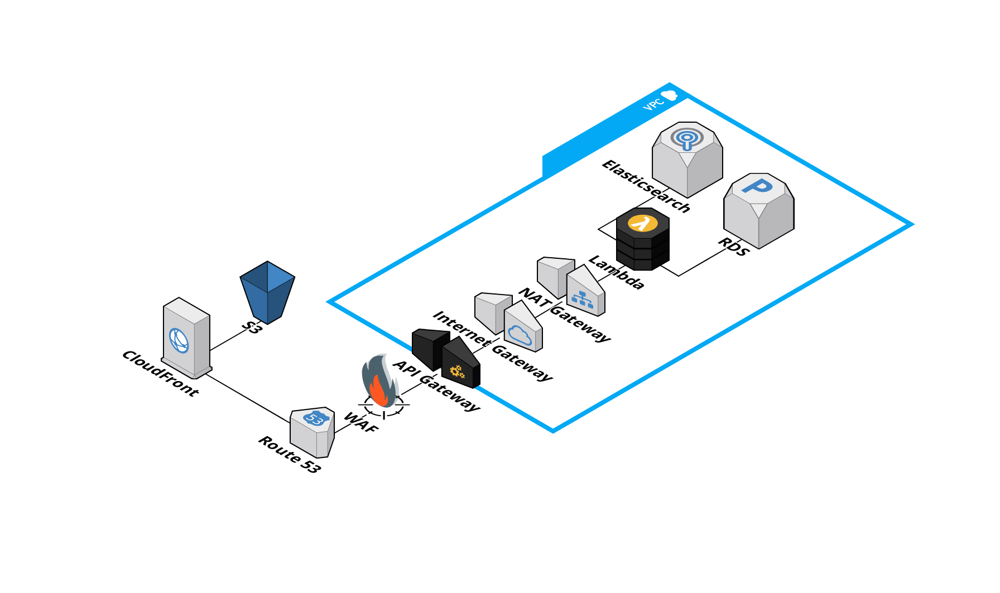
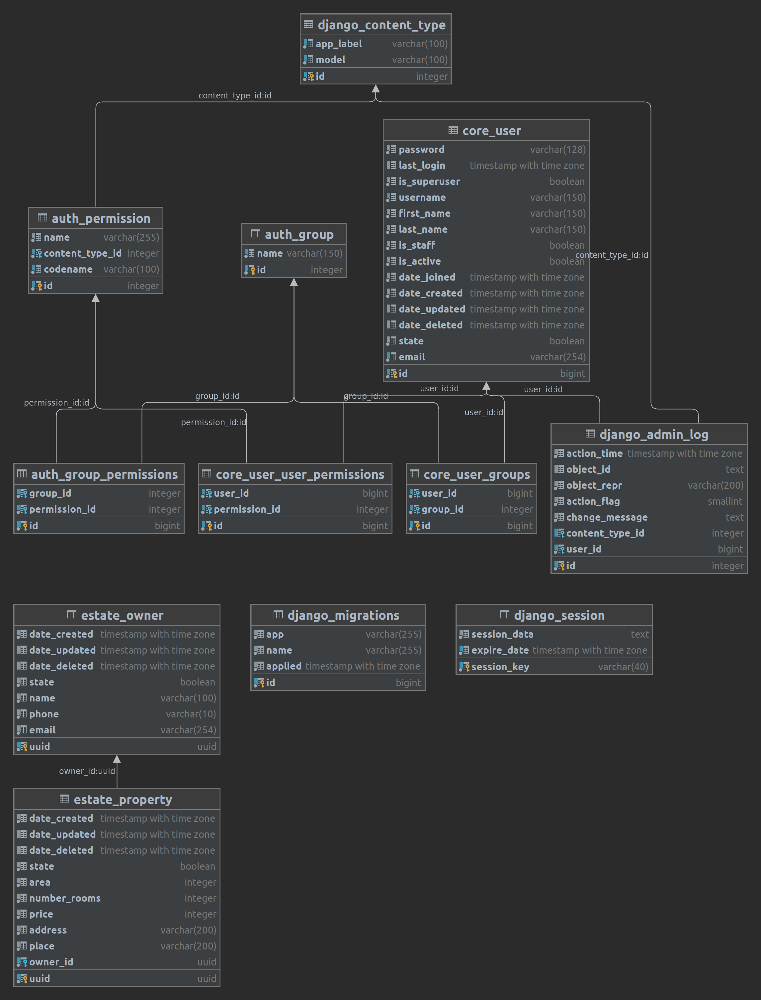

# Habi Test Project

## Setup

Please use docker to set up the entire project.

```sh
$ git submodule init && git submodule update
$ docker compose build
$ docker compose up -d
```

Once `docker` has finished downloading navigate to `http://127.0.0.1:8000/admin/` and `http://127.0.0.1:8888/`.
You will see the admin and welcome screen for the project. This project contains `CI` and `CD` strategies you can check
in using the submodule respectively.

## Infrastructure

This project was develop using `AWS Services`. You can check the infrastructure in this diagram:


The backend was deployed using `Django`, `Django Rest Framework` and `Zappa`. Also, `RDS - Postgres` was implemented to
save all data. Here you can find the `MER`:


The key models are: 
- `estate_owner` saves owner's data.
- `estate_property` saves property's data.

## APIRest

You can see it using the endpoint [docs](https://dvfvi2d961.execute-api.us-east-1.amazonaws.com/prod/docs). The key 
endpoint is:

- /api/habi/estate/. Allows to create and list estate.

## Secutiry

The projects uses `JWT` to access. Please write an email to grant access.

## Live Demo

Please check this URLs:

- https://d29vhrrlc81331.cloudfront.net/ (Frontend)
- https://dvfvi2d961.execute-api.us-east-1.amazonaws.com/prod/ (Backend)